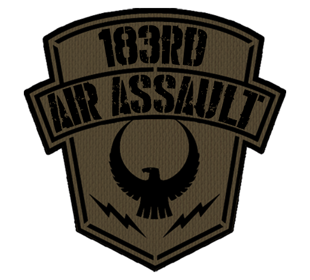

    

    
    
    
    

# 183rd Custom Mod
# 📡 OETA Radio Auto-Tune System  
### Config-Driven Radio Plans for Arma Reforger (1.6)

The **OETA Radio Auto-Tune System** provides a modular, data-driven way to define radio frequencies and channel names in Arma Reforger.  
It loads **channel plans from a .conf file**, applies them automatically based on a player’s group frequency, and stores readable channel names on the player for UI use.

This system works with **any faction, any mission, any radio prefab**, without modifying radio entities.

---

## 🚀 Features

- ✔ Load channel plans from `.conf` files (no scripting required)
- ✔ Automatic assignment of:
  - **Group frequency** (Channel 1)
  - **Faction frequency** (Channel 2)
  - **Plan-specific channels** (Channel 3–8 by default)
- ✔ Player-based channel name storage
- ✔ Works on server or client depending on config
- ✔ No radio prefab editing
- ✔ Pure script + config workflow
- ✔ Extendable UI integration (optional)

---

## 📁 File Layout

Scripts/
└── Game/
└── OETA_RadioAutoTuneComponent.c

Configs/
└── OETA_RadioPlans.conf

